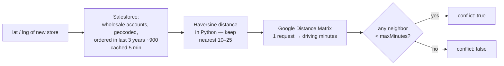

# Conflict Checker — Nearby-Stockist Check for New Customers

**Endpoint:** `GET /api/accounts/nearby` · **Added:** 2026-07-17 · **Standalone tool page:** `/conflict.html`
Design spec: [`superpowers/specs/2026-07-17-nearby-conflict-check-design.md`](superpowers/specs/2026-07-17-nearby-conflict-check-design.md)

## What it does

When a **new customer** (someone not found in Salesforce) fills the wholesale order form, Wooden Ships wants to know:

> *"Is there already a store selling Wooden Ships too close to this new store?"*

This is brand protection: two stockists on the same street compete for the same shoppers. The conflict checker answers that question with data instead of memory.

**The rule: a conflict exists when an existing wholesale account is less than a 20-minute drive from the new customer's store.**

Drive time is used instead of straight-line distance on purpose — two stores 2 miles apart across a river can be a 40-minute drive from each other, while 10 miles down one highway can be 12 minutes. Twenty minutes of driving is what "same shopping area" actually means to a customer.

## The standalone tool page

`https://<site>/conflict.html` is an independent internal page (not linked from the order form): type a location in the Google search box, pick a suggestion, and it shows the verdict banner plus the nearest-stockists table. The drive-time threshold and how many neighbors to show are adjustable on the page. It is a second Vite entry (`frontend/src/conflict/`), so it reuses the same Google Maps browser key and deploys with the normal frontend build — nothing extra to configure.

**Protecting the page:** it has no login by default and exposes the stockist list, so before (or right after) exposing it on the public VM, enable the prepared basic-auth block:

1. On the VM, create the password file (prompts for the password):
   `mkdir -p secrets && printf "admin:$(openssl passwd -apr1)\n" > secrets/htpasswd`
2. In `docker-compose.yml`, add to the nginx service volumes: `- ./secrets/htpasswd:/etc/nginx/htpasswd:ro`
3. Uncomment the `location = /conflict.html` block in `frontend/nginx.conf`, then `docker compose build nginx && docker compose up -d nginx`.

The `secrets/` directory must never be committed (add it to `.gitignore` if it isn't).

## How to call it

```
GET /api/accounts/nearby?lat=41.8781&lng=-87.6298
```

| Parameter | Required | Default | Meaning |
|---|---|---|---|
| `lat` | yes | — | Latitude of the new customer's **Ship To** store location (−90…90) |
| `lng` | yes | — | Longitude (−180…180) |
| `k` | no | 5 | How many nearest stores to return (1…25) |
| `maxMinutes` | no | 20 | Conflict threshold in driving minutes (1…240) |

The `lat`/`lng` come free from the order form: when the buyer picks their address with the Google Maps search box, the form captures the coordinates.

### Example response

```json
{
  "conflict": true,
  "mode": "drive-time",
  "maxMinutes": 20,
  "neighbors": [
    {
      "accountId": "001GC00003jfHTNYA2",
      "name": "A PIED",
      "cityState": "Chicago, IL",
      "lastOrder": "2024-11-08",
      "distanceMiles": 3.6,
      "driveMinutes": 10
    },
    {
      "accountId": "00190000009HHnXAAW",
      "name": "CINNAMON BOUTIQUE",
      "cityState": "Chicago, IL",
      "lastOrder": "2023-09-15",
      "distanceMiles": 5.2,
      "driveMinutes": 16
    }
  ]
}
```

| Field | Meaning |
|---|---|
| `conflict` | `true` if **any** neighbor is closer than `maxMinutes` of driving. This is the yes/no answer. |
| `mode` | `"drive-time"` (normal) or `"straight-line"` (fallback — see below) |
| `maxMinutes` | The threshold that was applied |
| `neighbors` | The k nearest existing wholesale stores, closest first — the **evidence** behind the verdict, ready to show in any future review UI |
| `driveMinutes` | Real driving time from Google; `null` if Google couldn't route it (or in fallback mode) |
| `lastOrder` | Date of that store's most recent sales order (what qualifies it as an active stockist) |

Bad input (latitude 123, missing `lng`, `k` = 0 …) returns a standard `422` validation error.

## How it works inside



1. **Candidate set** — Salesforce accounts with `Type = 'Wholesale'`, a shipping geocode, **and at least one sales order in the last 3 years** (`CONFLICT_ORDER_YEARS`, decision 2026-07-17 — a store that hasn't ordered in 3 years isn't an active stockist). That's ~900 accounts, out of ~4,400 geocoded wholesale accounts. Salesforce geocodes shipping addresses automatically, so we maintain no coordinates ourselves. The list is cached for 5 minutes like the other Salesforce lookups.
2. **Pre-filter** — straight-line (haversine) distance to every candidate, keep the nearest 10–25. This is exact math over a few thousand points; it takes milliseconds and costs nothing.
3. **Drive times** — one Google Distance Matrix request for just those finalists (25 is Google's per-request limit — which is why the pre-filter exists). Only raw coordinates are sent to Google, never store names or Salesforce ids.
4. **Verdict** — sort by drive time, return the top `k`, and flag `conflict` if anything is under the threshold.

## The two modes

| | `drive-time` | `straight-line` |
|---|---|---|
| When | `GOOGLE_MAPS_SERVER_API_KEY` is configured and Google responds | Key missing, or Google errored/timed out |
| `driveMinutes` | real minutes | always `null` |
| Conflict rule | drive < `maxMinutes` | distance < `maxMinutes × 0.5` miles (assumes 30 mph, so 20 min ≈ 10 miles) |

The endpoint **never fails because Google is down** — it degrades to straight-line mode and says so in `mode`, so a caller can always distinguish an approximate verdict from a real one.

> **Current state:** the server key is not configured yet, so the API runs in straight-line mode today. See setup below.

## Setup: enabling real drive times

1. In Google Cloud console, create a **new API key** (do not reuse the browser key from `frontend/.env` — that one is referrer-restricted and public).
2. Restrict the new key: **IP restriction** to the GCP VM, API restriction to **Distance Matrix API** only.
3. In the backend `.env`:
   ```
   GOOGLE_MAPS_SERVER_API_KEY=<the new key>
   CONFLICT_MAX_MINUTES=20        # optional, this is the default
   ```
4. `docker compose up -d backend` to restart.

**Cost:** about $5 per 1,000 destination lookups → ~10 destinations per check ≈ **$0.05 per new-customer check**. It only runs when someone calls the endpoint.

## Where the code lives

| Piece | File |
|---|---|
| Route + parameter validation | `backend/app/routers/accounts.py` (`nearby_accounts`) |
| Haversine + nearest-candidate selection | `backend/app/geo/distance.py` |
| Google Distance Matrix client | `backend/app/geo/drive_time.py` |
| Orchestration, fallback, verdict | `backend/app/geo/conflict.py` |
| Salesforce query + field names | `backend/app/salesforce/client.py`, `mapping.py` |
| Config | `backend/app/config.py`, `.env.example` |
| Tests (28 total incl. this feature) | `backend/tests/test_geo_distance.py`, `test_drive_time.py`, `test_conflict.py`, `test_nearby_endpoint.py` |

## Known limitations / open decisions

- ~~Closed stores count as stockists~~ — **RESOLVED 2026-07-17** by the order-history filter: candidates must have ordered within the last 3 years, and none of the 267 "(CLOSED)"-named accounts have (verified against the org). Tune the window with `CONFLICT_ORDER_YEARS`.
- **Where the check surfaces is undecided** — on the form at submit time, an admin review screen, or a rep tool; and whether a conflict *blocks* the order or just *warns*. The API deliberately returns both the verdict and the evidence so any of these work.
- **New-customer coordinates are required.** If a buyer types their address by hand instead of using the map search, there are no coordinates to check. A future improvement could geocode the typed address server-side.
- Salesforce data is cached for 5 minutes, so an account created seconds ago may not appear immediately.
