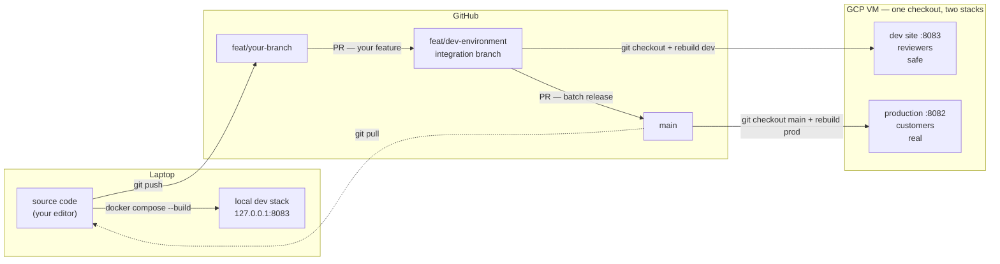
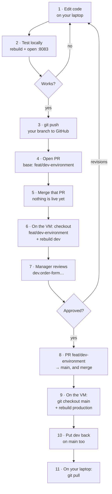

# The full picture — from your editor to customers

Start here. The other files in this folder are the detailed steps; this one is
the map they all sit on.

- **Just want the commands?** → [The daily loop](#the-daily-loop)
- **Confused about what "dev" means?** → [Two things that trip everyone up](#two-things-that-trip-everyone-up)
- **Want the whole picture?** → [The map](#the-map)

---

## The daily loop

Edit → push → PR → pull → test. Four stages, copy-pasteable. Detail for each is
in [`local-workflow.md`](local-workflow.md) and
[`deploy-to-dev.md`](deploy-to-dev.md).

### 1 · Push your edit

```bash
cd ~/Automation/wholesale-order-entry

git branch --show-current        # must NOT be main
git status --short               # read this before staging — no surprises

git add -A
git commit -m "feat: what you did"
git push -u origin feat/<your-branch>
```

**Check it worked** — no `[ahead N]` means GitHub has everything:

```bash
git status -sb
## feat/your-branch...origin/feat/your-branch      ← in sync ✓
```

> Working on a branch that doesn't exist yet? Create it from the integration
> branch first, so you start from what dev is already running:
> ```bash
> git checkout feat/dev-environment && git pull
> git checkout -b feat/<your-branch>
> ```

### 2 · Open the PR into `feat/dev-environment`

`gh` is not installed, so use the web UI. `git push` prints a direct link:

```
remote: Create a pull request for 'feat/xyz' on GitHub by visiting:
remote:      https://github.com/Wooden-Ships-Knits/wholesale-order-entry/pull/new/feat/xyz
```

- **Base:** `feat/dev-environment`  ·  **Compare:** `feat/<your-branch>`

> ⚠️ **GitHub pre-selects `main` as the base.** Change it in the dropdown every
> single time. Left on `main`, your feature aims straight at production's branch
> and skips your manager's review entirely.

Then **merge the PR** on GitHub. Nothing is live yet — this only moves your work
into the branch the dev site is built from.

### 3 · Pull the integration branch locally

The merge happened on GitHub's servers. Your laptop knows nothing until you ask:

```bash
git checkout feat/dev-environment
git pull
```

**Check your work actually arrived:**

```bash
git log --oneline -3        # your commit should be in this list
```

Tidy up the merged branch while you are here (optional):

```bash
git branch -d feat/<your-branch>              # local
git push origin --delete feat/<your-branch>   # on GitHub
```

### 4 · Test locally

Paste once per terminal session:

```bash
dev() { docker compose -f docker-compose.dev.yml --env-file .env.dev "$@"; }
```

Then rebuild whichever part you changed and open it:

```bash
dev up -d --build nginx      # frontend changed
dev up -d --build backend    # backend changed — then: dev restart nginx
```

**Confirm you are on the dev stack before testing anything that submits or
emails:**

```bash
curl -s http://127.0.0.1:8083/api/health; echo
# {"status":"ok","env":"development","dev":true,
#  "mailRedirected":true,"salesforceReadonly":true}
```

`"dev":true` = safe. Then open **http://127.0.0.1:8083/admin** and hard refresh
(`Cmd+Shift+R`).

If your change isn't there, the rebuild didn't take — ask the container directly:

```bash
docker exec wholesale-dev-nginx-1 \
  sh -c "grep -l 'text from your change' /usr/share/nginx/html/assets/*.js"
```

A path printed = it's in the build. Silence = rebuild again, and re-read
[the one rule](local-workflow.md#the-one-rule).

### What happens after

The loop above ends at "it works on my laptop". Getting it in front of your
manager and then to customers is steps 6–11 of
[the full sequence](#the-full-sequence) — deploy `feat/dev-environment` to the
dev site on the VM, get approval, then PR that branch into `main`.

---

## Two things that trip everyone up

Get these two right and the rest follows.

### 1. "dev" means two different things

Both exist. Mixing them up is the single biggest source of confusion:

| When someone says "dev" | They may mean | Which lives |
|---|---|---|
| the **branch** | `feat/dev-environment` — where feature PRs are collected | on GitHub |
| the **environment** | a second set of containers, port `8083` | on the VM / your laptop |

There is no branch named literally `dev`. The integration branch is called
`feat/dev-environment` — the `feat/` prefix disguises it, but it is long-lived
and it is where your PRs go.

**The branch flow is two hops, not one** — because there is an approval gate in
the middle:

```
feat/your-branch ──PR──► feat/dev-environment ──deploy──► dev site :8083
                                                              │
                                                       manager reviews
                                                              │
                          feat/dev-environment ──PR──► main ──► production
```

`main` is what production runs, so nothing reaches it unapproved. The integration
branch is the holding area where work waits for sign-off, and **the dev site
serves that branch** — which is why the two share a name. Your change is not
visible on dev until your PR has been merged into it.

Verify it yourself — every merge into `feat/dev-environment` is a feature PR,
and that branch is then PR'd into `main` in batches (#112, #115):

```bash
git log --oneline --merges -6 origin/feat/dev-environment
#   Merge pull request #116 from …/feat/add-excel
#   Merge pull request #114 from …/feat/fix-1
#   Merge pull request #109 from …/feat/fix-change-account
#   …
```

The **environment** is separate from all of that. It is a place you deploy to,
and you can point it at any branch. Opening a PR deploys nothing; deploying to
dev needs no PR.

### 2. Nothing updates itself

Three separate copies of your code exist, and **none of them syncs
automatically**:

| Copy | Updated by | Never updated by |
|---|---|---|
| Your local git branches | `git pull` | merging a PR on GitHub |
| GitHub | `git push`, merging a PR | editing files locally |
| The running containers | `docker compose --build` | editing files, `git pull` |

Two consequences people hit constantly:

- **You merged a PR on GitHub, so your local `main` is up to date** — no. That
  merge happened on GitHub's servers. Your laptop learns nothing until
  `git pull`.
- **You edited a file, so the site shows it** — no. Containers serve a *build*
  made when the image was built. Until you rebuild, they serve the old one.
  ([why](local-workflow.md#the-one-rule))

---

## The map



Every arrow is a command **you type**. There is no CI, no webhook, no automatic
deploy anywhere in this picture — see
[what is not automated](local-workflow.md#what-is-not-automated).

---

## The full sequence



Two things people get wrong here:

- **Step 5 comes before step 6.** The dev site serves `feat/dev-environment`, so
  your change is invisible there until your PR is merged into it. Deploying
  before merging shows your manager the *old* code.
- **Step 11 is the one everyone forgets**, and it is why local branches drift
  behind. Nothing in steps 8–10 touches your laptop.

Steps 5 and 8 are **separate merges**, often days apart: your feature lands in
`feat/dev-environment` when you are happy with it, and that branch ships to
`main` only after your manager approves it on the dev site.

| Steps | Where | Detailed doc |
|---|---|---|
| 1–2 | laptop | [`local-workflow.md`](local-workflow.md) |
| 3–7 | laptop → GitHub → VM → manager | [`deploy-to-dev.md`](deploy-to-dev.md) |
| 8–11 | GitHub → VM → laptop | [`release-flow.md`](release-flow.md) |

---

## The two environments

Identical to look at. The red **DEVELOPMENT** bar is the only visible difference.

| | Development | Production |
|---|---|---|
| URL | `dev.order-form.woodenships-wholesale.com` | `order-form.woodenships-wholesale.com` |
| Port on the VM | `127.0.0.1:8083` (loopback only) | `0.0.0.0:8082` |
| Access | basic auth (`reviewer`) | public |
| Runs which branch | **`feat/dev-environment`** (the integration branch) | **`main` only** |
| Compose project | `wholesale-dev` | `wholesale-order-entry` |
| Env file | `.env.dev` | `.env` |
| Database | its own volume | the real one |
| Salesforce reads | **live — real customer data** | live |
| Salesforce writes | **blocked** | allowed |
| Outbound email | **redirected to a test inbox** | real reps and buyers |

Confirm which one you are on before trusting any test:

```bash
curl -s http://127.0.0.1:8083/api/health; echo
# {"status":"ok","env":"development","dev":true,
#  "mailRedirected":true,"salesforceReadonly":true}
```

`"dev":true` = safe. `"dev":false` on port 8083 means the safety switches did not
load — **stop**, that container can email real customers.

Details: [`../dev-environment.md`](../dev-environment.md).

---

## What each action actually changes

The table that answers most "why didn't that work" questions.

| You do | Changes | Does **not** change |
|---|---|---|
| Save a file in your editor | the file on disk | any running site |
| `docker compose … --build` | your local containers | GitHub, the VM |
| `git commit` | your local history | GitHub, any site |
| `git push` | GitHub's copy of your branch | `main`, any site, the VM |
| Open a PR | nothing but a page on GitHub | code anywhere |
| Merge the PR | `main` **on GitHub** | your local `main`, any running site |
| `git fetch` | your `origin/*` pointers | your own branches |
| `git pull` | your current local branch | GitHub, any site |
| Rebuild dev on the VM | the dev site | production, your laptop |
| Rebuild prod on the VM | the live site | dev, your laptop |

---

## Where am I? — orientation commands

When lost, these four answer it:

```bash
git branch --show-current     # which branch am I on?
git status -sb                # am I ahead of / behind GitHub?
git log --oneline -1 main origin/main   # is my local main stale?
curl -s http://127.0.0.1:8083/api/health  # which environment is this?
```

`git status -sb` is the quickest tell:

```
## feat/add-excel...origin/feat/add-excel          ← in sync
## feat/add-excel...origin/feat/add-excel [ahead 1]   ← you must push
## main...origin/main [behind 22]                  ← you must pull
```

---

## The one that will bite you

**The VM has a single checkout that both stacks build from.** While it sits on a
feature branch for dev review, a plain `docker compose up -d --build` — no `-f`,
no `--env-file` — rebuilds **production** from that unreviewed branch.

Nothing warns you. Containers restart, the site keeps working, and production is
quietly serving code nobody approved.

Habit: run `git branch --show-current` before every production rebuild. The
permanent fix (a second checkout) is written up in
[release-flow.md](release-flow.md#the-one-real-footgun).

---

## Which doc do I need?

| I want to… | Read |
|---|---|
| Test my edit locally with Docker | [`local-workflow.md`](local-workflow.md) |
| Push, open a PR, and run it on dev | [`deploy-to-dev.md`](deploy-to-dev.md) |
| Merge and release to production | [`release-flow.md`](release-flow.md) |
| Understand why dev is safe | [`../dev-environment.md`](../dev-environment.md) |
| Set the dev site up for the first time | [`dev-on-vm.md`](dev-on-vm.md) |
| Set up HTTPS / a domain | [`https-and-domain.md`](https-and-domain.md) |
| Fix a 502, or "my change isn't showing" | [`local-workflow.md`](local-workflow.md#troubleshooting) |
