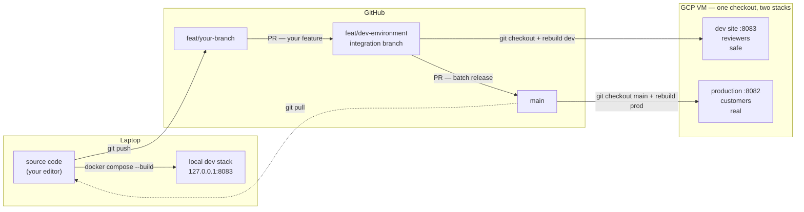
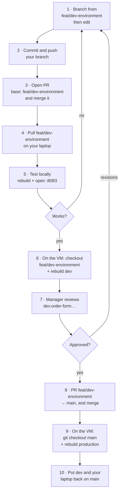

# The full picture — from your editor to customers

Start here. The other files in this folder are the detailed steps; this one is
the map they all sit on.

- **Just want the commands?** → [The daily loop](#the-daily-loop)
- **Confused about what "dev" means?** → [Two things that trip everyone up](#two-things-that-trip-everyone-up)
- **Want the whole picture?** → [The map](#the-map)

---

## The daily loop

Ten stages end to end, copy-pasteable. Stages 1–7 are the daily loop; 8–10 are
[the release](#the-release--dev-to-production), which happens less often.

| | Stage | Where |
|---|---|---|
| 1 | [Start your branch from `feat/dev-environment`](#1--start-your-branch-from-featdev-environment) | laptop |
| 2 | [Push your edit](#2--push-your-edit) | laptop |
| 3 | [Open the PR into `feat/dev-environment`](#3--open-the-pr-into-featdev-environment) | GitHub |
| 4 | [Pull the integration branch locally](#4--pull-the-integration-branch-locally) | laptop |
| 5 | [Test locally](#5--test-locally) | laptop `:8083` |
| 6 | [Pull and restart dev on the VM](#6--pull-and-restart-dev-on-the-vm) | VM |
| 7 | [Verify, then hand it over](#7--verify-then-hand-it-over) | VM → manager |
| — | *manager approves* | |
| 8 | [Open the release PR](#8--open-the-release-pr) | GitHub |
| 9 | [Deploy production on the VM](#9--deploy-production-on-the-vm) | VM |
| 10 | [Put everything back on `main`](#10--put-everything-back-on-main) | VM + laptop |

Detail for each is in [`local-workflow.md`](local-workflow.md),
[`deploy-to-dev.md`](deploy-to-dev.md) and
[`release-flow.md`](release-flow.md).

### 1 · Start your branch from `feat/dev-environment`

Do this **before** you edit anything.

```bash
cd ~/Automation/wholesale-order-entry

git checkout feat/dev-environment
git pull                              # don't skip — see below
git checkout -b feat/<your-branch>
```

**Not from `main`.** `main` is production, and the integration branch is
normally ahead of it with work that is approved but not yet released. Branch
from `main` and you start without those commits, then have to reconcile two
histories when you PR back — conflicts you never needed.

The rule: **branch from what you will PR into.** You PR into
`feat/dev-environment`, so start there.

```bash
# see for yourself what you would have missed
git log --oneline origin/main..origin/feat/dev-environment
```

`git pull` matters just as much: without it you branch from yesterday's copy and
re-introduce whatever landed since.

> **Already edited before reading this?** Nothing is lost — `git checkout -b`
> carries uncommitted changes onto the new branch. Just run it now.

### 2 · Push your edit

```bash
git branch --show-current        # must NOT be main or feat/dev-environment
git status --short               # read this before staging — no surprises

git add -A
git commit -m "feat: what you did"
git push -u origin feat/<your-branch>
```

**Check it worked** — no `[ahead N]` means GitHub has everything:

```bash
git status -sb
## feat/your-branch...origin/feat/your-branch      ← in sync ✓
```

### 3 · Open the PR into `feat/dev-environment`

`gh` is not installed, so use the web UI. `git push` prints a direct link:

```
remote: Create a pull request for 'feat/xyz' on GitHub by visiting:
remote:      https://github.com/Wooden-Ships-Knits/wholesale-order-entry/pull/new/feat/xyz
```

- **Base:** `feat/dev-environment`  ·  **Compare:** `feat/<your-branch>`

> ⚠️ **GitHub pre-selects `main` as the base.** Change it in the dropdown every
> single time. Left on `main`, your feature aims straight at production's branch
> and skips your manager's review entirely.

Then **merge the PR** on GitHub. Nothing is live yet — this only moves your work
into the branch the dev site is built from.

### 4 · Pull the integration branch locally

The merge happened on GitHub's servers. Your laptop knows nothing until you ask:

```bash
git checkout feat/dev-environment
git pull
```

**Check your work actually arrived:**

```bash
git log --oneline -3        # your commit should be in this list
```

Tidy up the merged branch while you are here (optional):

```bash
git branch -d feat/<your-branch>              # local
git push origin --delete feat/<your-branch>   # on GitHub
```

### 5 · Test locally

Rebuild whichever part you changed:

```bash
# frontend changed
docker compose -f docker-compose.dev.yml --env-file .env.dev up -d --build nginx
```

```bash
# backend changed — restart nginx after, or you get a 502
docker compose -f docker-compose.dev.yml --env-file .env.dev up -d --build backend
docker compose -f docker-compose.dev.yml --env-file .env.dev restart nginx
```

**Confirm you are on the dev stack before testing anything that submits or
emails:**

```bash
curl -s http://127.0.0.1:8083/api/health; echo
# {"status":"ok","env":"development","dev":true,
#  "mailRedirected":true,"salesforceReadonly":true}
```

`"dev":true` = safe. Then open **http://127.0.0.1:8083/admin** and hard refresh
(`Cmd+Shift+R`).

If your change isn't there, the rebuild didn't take — ask the container directly:

```bash
docker exec wholesale-dev-nginx-1 \
  sh -c "grep -l 'text from your change' /usr/share/nginx/html/assets/*.js"
```

A path printed = it's in the build. Silence = rebuild again, and re-read
[the one rule](local-workflow.md#the-one-rule).

### 6 · Pull and restart dev on the VM

Now put it where your manager can see it. Everything below runs **on the VM**.

```bash
ssh <vm>                          # see deploy-to-dev.md if unsure
cd ~/wholesale-order-entry
```

**Safety check first — which branch is this checkout on?** The VM has one
checkout shared by both stacks, so this is also the branch production would be
rebuilt from:

```bash
git branch --show-current
git status --short                # must be clean — the VM is not for editing
```

Pull the integration branch:

```bash
git fetch origin
git checkout feat/dev-environment
git pull

git log --oneline -3              # your commit should be here
```

`git fetch` first, or `checkout` won't see commits pushed minutes ago.

Restart the dev stack with the new code. **Both flags are mandatory** — without
them you rebuild *production* from an unapproved branch, silently:

```bash
docker compose -f docker-compose.dev.yml --env-file .env.dev up -d --build
```

**Schema changed?** Dev has its own database. Migrations are baked into the
image, so the rebuild above must come first — then ask the database whether
anything is pending:

```bash
docker compose -f docker-compose.dev.yml --env-file .env.dev exec backend alembic current
docker compose -f docker-compose.dev.yml --env-file .env.dev exec backend alembic heads
```

Different → apply them:

```bash
docker compose -f docker-compose.dev.yml --env-file .env.dev exec backend alembic upgrade head
```

**Got a 502?** nginx cached the backend's old container IP:

```bash
docker compose -f docker-compose.dev.yml --env-file .env.dev restart nginx
```

### 7 · Verify, then hand it over

```bash
curl -s http://127.0.0.1:8083/api/health; echo
# {"status":"ok","env":"development","dev":true,
#  "mailRedirected":true,"salesforceReadonly":true}
```

**`"env":"production"` here means stop.** `.env.dev` did not load, and that
container can email real reps and write to the live Salesforce org.

Then open `https://dev.order-form.woodenships-wholesale.com` (basic auth:
`reviewer`) and check before telling anyone:

- [ ] Red **DEVELOPMENT** bar on every page
- [ ] Your change is visible — hard refresh, `Cmd+Shift+R`
- [ ] Production still loads, with **no** bar

Send your manager the URL, the credentials, and **what to click**.

**Revisions?** Back to stage 1 with a new branch. **Approved?** → the release,
below.

---

## The release — dev to production

Stages 8–10. Not daily: this ships everything sitting in `feat/dev-environment`
as one batch, and only after your manager has approved it on the dev site.

This is the only part of the flow that customers can see go wrong. Read
[`release-flow.md`](release-flow.md) too — it covers rollback.

### 8 · Open the release PR

On GitHub, a second PR — the reverse direction from your feature PR:

- **Base:** `main`  ·  **Compare:** `feat/dev-environment`

Here `main` **is** the correct base. Check the diff once more: it is everything
merged into the integration branch since the last release, not just your change.

```bash
# preview what this release contains, before opening it
git log --oneline origin/main..origin/feat/dev-environment
git diff --stat origin/main...origin/feat/dev-environment
```

Merge it on GitHub. Production still does not have it — merging updates the
branch, not the server.

### 9 · Deploy production on the VM

```bash
ssh <vm>
cd ~/wholesale-order-entry
```

```bash
git checkout main            # ← the step that is easy to forget
git pull
git branch --show-current    # confirm it really says: main
```

> ⚠️ **This is the dangerous moment.** The next command has **no** `-f` and
> **no** `--env-file` — that is what makes it production. If the checkout is
> still on a feature branch, you have just shipped unapproved code to customers
> and nothing will warn you.

```bash
docker compose up -d --build
```

**Schema changed in this release?** Ask the database, not git — this compares
where the **DB** is against where the **code** is:

```bash
docker compose exec backend alembic current   # the database's revision
docker compose exec backend alembic heads     # the revision this image expects
```

Identical → nothing to do. Different → migrations are pending:

```bash
docker compose exec backend alembic upgrade head
docker compose exec backend alembic current   # should now match heads
```

> **Migrations do not roll back.** A code rollback leaves an applied migration in
> place. Check what a migration does before running it here — this is the real
> customer database. See
> [release-flow.md](release-flow.md#rolling-production-back).

**502?** Same stale-DNS cause as on dev — nginx cached the backend's old IP:

```bash
docker compose restart nginx
```

Verify:

```bash
curl -s https://order-form.woodenships-wholesale.com/api/health; echo
# {"status":"ok","env":"production","dev":false,
#  "mailRedirected":false,"salesforceReadonly":false}
```

- [ ] `"env":"production"` and `"dev":false`
- [ ] **No** DEVELOPMENT bar anywhere on the site
- [ ] The change you shipped is actually visible
- [ ] Submit still works end to end

### 10 · Put everything back on `main`

Leave the VM on `main`, so the next person's plain `docker compose up -d --build`
cannot ship an unreviewed branch:

```bash
# still on the VM, still on main
docker compose -f docker-compose.dev.yml --env-file .env.dev up -d --build
```

Dev now mirrors production, which is the right resting state — the next feature
starts from a clean base.

Finally, on your laptop:

```bash
git checkout main
git pull
```

Skip this and your local `main` silently drifts behind, which is how branches get
started from stale code.

> **Never leave the VM on a feature branch.** See
> [the footgun](#the-one-that-will-bite-you).

---

## Two things that trip everyone up

Get these two right and the rest follows.

### 1. "dev" means two different things

Both exist. Mixing them up is the single biggest source of confusion:

| When someone says "dev" | They may mean | Which lives |
|---|---|---|
| the **branch** | `feat/dev-environment` — where feature PRs are collected | on GitHub |
| the **environment** | a second set of containers, port `8083` | on the VM / your laptop |

There is no branch named literally `dev`. The integration branch is called
`feat/dev-environment` — the `feat/` prefix disguises it, but it is long-lived
and it is where your PRs go.

**The branch flow is two hops, not one** — because there is an approval gate in
the middle:

```
feat/your-branch ──PR──► feat/dev-environment ──deploy──► dev site :8083
                                                              │
                                                       manager reviews
                                                              │
                          feat/dev-environment ──PR──► main ──► production
```

`main` is what production runs, so nothing reaches it unapproved. The integration
branch is the holding area where work waits for sign-off, and **the dev site
serves that branch** — which is why the two share a name. Your change is not
visible on dev until your PR has been merged into it.

Verify it yourself — every merge into `feat/dev-environment` is a feature PR,
and that branch is then PR'd into `main` in batches (#112, #115):

```bash
git log --oneline --merges -6 origin/feat/dev-environment
#   Merge pull request #116 from …/feat/add-excel
#   Merge pull request #114 from …/feat/fix-1
#   Merge pull request #109 from …/feat/fix-change-account
#   …
```

The **environment** is separate from all of that. It is a place you deploy to,
and you can point it at any branch. Opening a PR deploys nothing; deploying to
dev needs no PR.

### 2. Nothing updates itself

Three separate copies of your code exist, and **none of them syncs
automatically**:

| Copy | Updated by | Never updated by |
|---|---|---|
| Your local git branches | `git pull` | merging a PR on GitHub |
| GitHub | `git push`, merging a PR | editing files locally |
| The running containers | `docker compose --build` | editing files, `git pull` |

Two consequences people hit constantly:

- **You merged a PR on GitHub, so your local `main` is up to date** — no. That
  merge happened on GitHub's servers. Your laptop learns nothing until
  `git pull`.
- **You edited a file, so the site shows it** — no. Containers serve a *build*
  made when the image was built. Until you rebuild, they serve the old one.
  ([why](local-workflow.md#the-one-rule))

---

## The map



Every arrow is a command **you type**. There is no CI, no webhook, no automatic
deploy anywhere in this picture — see
[what is not automated](local-workflow.md#what-is-not-automated).

---

## The full sequence

The same ten stages as [the daily loop](#the-daily-loop), as a picture:



Three things people get wrong here:

- **Stage 1 is a stage.** Branch from `feat/dev-environment`, not `main`, and
  pull first. Getting this wrong is invisible until the merge conflicts.
- **Stage 3 comes before stage 6.** The dev site serves `feat/dev-environment`,
  so your change is invisible there until your PR is merged into it. Deploying
  before merging shows your manager the *old* code.
- **Stage 10 is the one everyone forgets**, and it is why local branches drift
  behind. Nothing in stages 8–9 touches your laptop.

Stages 3 and 8 are **separate merges**, often days apart: your feature lands in
`feat/dev-environment` when you are happy with it, and that branch ships to
`main` only after your manager approves it on the dev site.

| Stages | Where | Detailed doc |
|---|---|---|
| 1–2, 4–5 | laptop | [`local-workflow.md`](local-workflow.md) |
| 3, 6–7 | GitHub → VM → manager | [`deploy-to-dev.md`](deploy-to-dev.md) |
| 8–10 | GitHub → VM → laptop | [`release-flow.md`](release-flow.md) |

---

## The two environments

Identical to look at. The red **DEVELOPMENT** bar is the only visible difference.

| | Development | Production |
|---|---|---|
| URL | `dev.order-form.woodenships-wholesale.com` | `order-form.woodenships-wholesale.com` |
| Port on the VM | `127.0.0.1:8083` (loopback only) | `0.0.0.0:8082` |
| Access | basic auth (`reviewer`) | public |
| Runs which branch | **`feat/dev-environment`** (the integration branch) | **`main` only** |
| Compose project | `wholesale-dev` | `wholesale-order-entry` |
| Env file | `.env.dev` | `.env` |
| Database | its own volume | the real one |
| Salesforce reads | **live — real customer data** | live |
| Salesforce writes | **blocked** | allowed |
| Outbound email | **redirected to a test inbox** | real reps and buyers |

Confirm which one you are on before trusting any test:

```bash
curl -s http://127.0.0.1:8083/api/health; echo
# {"status":"ok","env":"development","dev":true,
#  "mailRedirected":true,"salesforceReadonly":true}
```

`"dev":true` = safe. `"dev":false` on port 8083 means the safety switches did not
load — **stop**, that container can email real customers.

Details: [`../dev-environment.md`](../dev-environment.md).

---

## What each action actually changes

The table that answers most "why didn't that work" questions.

| You do | Changes | Does **not** change |
|---|---|---|
| Save a file in your editor | the file on disk | any running site |
| `docker compose … --build` | your local containers | GitHub, the VM |
| `git commit` | your local history | GitHub, any site |
| `git push` | GitHub's copy of your branch | `main`, any site, the VM |
| Open a PR | nothing but a page on GitHub | code anywhere |
| Merge the PR | `main` **on GitHub** | your local `main`, any running site |
| `git fetch` | your `origin/*` pointers | your own branches |
| `git pull` | your current local branch | GitHub, any site |
| Rebuild dev on the VM | the dev site | production, your laptop |
| Rebuild prod on the VM | the live site | dev, your laptop |

---

## Where am I? — orientation commands

When lost, these four answer it:

```bash
git branch --show-current     # which branch am I on?
git status -sb                # am I ahead of / behind GitHub?
git log --oneline -1 main origin/main   # is my local main stale?
curl -s http://127.0.0.1:8083/api/health  # which environment is this?
```

`git status -sb` is the quickest tell:

```
## feat/add-excel...origin/feat/add-excel          ← in sync
## feat/add-excel...origin/feat/add-excel [ahead 1]   ← you must push
## main...origin/main [behind 22]                  ← you must pull
```

---

## The one that will bite you

**The VM has a single checkout that both stacks build from.** While it sits on a
feature branch for dev review, a plain `docker compose up -d --build` — no `-f`,
no `--env-file` — rebuilds **production** from that unreviewed branch.

Nothing warns you. Containers restart, the site keeps working, and production is
quietly serving code nobody approved.

Habit: run `git branch --show-current` before every production rebuild. The
permanent fix (a second checkout) is written up in
[release-flow.md](release-flow.md#the-one-real-footgun).

---

## Which doc do I need?

| I want to… | Read |
|---|---|
| Test my edit locally with Docker | [`local-workflow.md`](local-workflow.md) |
| Push, open a PR, and run it on dev | [`deploy-to-dev.md`](deploy-to-dev.md) |
| Merge and release to production | [`release-flow.md`](release-flow.md) |
| Understand why dev is safe | [`../dev-environment.md`](../dev-environment.md) |
| Set the dev site up for the first time | [`dev-on-vm.md`](dev-on-vm.md) |
| Set up HTTPS / a domain | [`https-and-domain.md`](https-and-domain.md) |
| Fix a 502, or "my change isn't showing" | [`local-workflow.md`](local-workflow.md#troubleshooting) |
