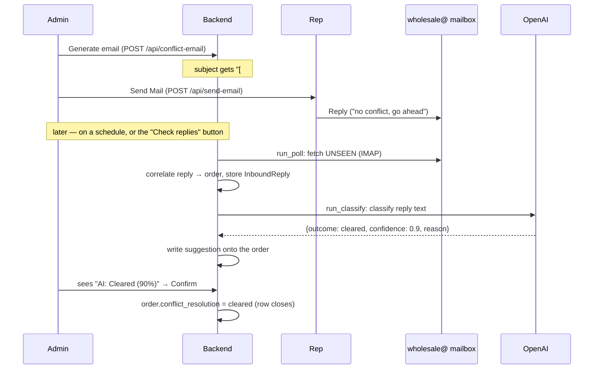

# Conflict Reply Tracking — Operations & Flow

**Status:** built (conflict flow) · **Updated:** 2026-07-25
**Design rationale:** [`reply-tracking-design.md`](reply-tracking-design.md)

How a reply to one of our order emails gets captured, tied back to the right
order, and acted on — and how to run it on a schedule in production. Two flows
share the same capture pipeline:

- **Conflict inquiry** (to the rep) → the reply is **classified by AI** into a
  suggestion an admin confirms.
- **Tax-certificate request** (to the customer) → the reply's **PDF/image
  attachment is saved** onto the order, flipping the dashboard to "Open". No AI —
  just a deterministic "did they attach the cert?" check.

## What it does

When a new account trips the nearby-stockist check, the admin sends the rep a
"potential conflict" email. Previously the answer came back into a mailbox and
someone had to track it by hand. This pipeline closes that loop:

1. captures the rep's reply from the `wholesale@` mailbox,
2. figures out which order it belongs to,
3. asks an LLM whether the conflict is resolved (cleared / real conflict),
4. shows that as a **suggestion** on the order row — which a human confirms.

The model never changes an order on its own; confirming is a human click.

## End-to-end flow



## Correlation — how a reply finds its order

Two independent signals, checked in order (`app/email/inbound.py` → `_correlate`):

1. **Plus-address token (primary).** The outbound email sets
   `Reply-To: wholesale+conflict-<order-id>@wooden-ships.com`. Gmail delivers
   `wholesale+…@` to the `wholesale@` inbox with the token intact, so a normal
   "Reply" carries the order id in its `To` / `Delivered-To`.
2. **Subject token (fallback).** The subject also carries `[#<order-id>]`
   (`CONFLICT Inquiry — TES2 [#9548e8ee-…]`). This survives a reply that lands on
   the **bare `wholesale@`** address with no plus-token — e.g. someone replies to
   the `From` instead of `Reply-To`, or a human at `wholesale@` replies into the
   thread first. The `Re:` reply keeps the subject, so the token rides along.

The plus-token wins when both are present. If neither is found, the message is
ignored (it isn't a reply to one of our tagged emails).

## Components

| Piece | Where |
|---|---|
| Outbound tagging (Reply-To + subject token) | `app/routers/send_email.py`, `app/email/conflict_template.py`, `app/email/reply_address.py` |
| Capture (IMAP) + correlate + store | `app/email/inbound.py` → `InboundReply` (`app/db/models.py`) |
| Classify (OpenAI) → suggestion on order (conflict) | `app/ai/conflict_reply.py` |
| Save cert attachment → `cert_filename` (tax cert) | `app/email/inbound.py` → `save_tax_cert` |
| Manual trigger (button) | `POST /api/admin/poll-replies`; `frontend/src/admin/AdminApp.jsx` ("Check replies") |
| Scheduled trigger (cron) | `python -m app.tasks.poll_replies` |
| Confirm a suggestion | `POST /api/admin/orders/{id}/conflict-resolution`; conflict cell in `frontend/src/admin/OrderTable.jsx` |

## Configuration (`.env`)

```
# Inbound capture — IMAP over SSL to the wholesale@ mailbox.
# Blank host/user/pass = disabled (the poller no-ops).
IMAP_HOST=imap.gmail.com
IMAP_PORT=993
IMAP_USER=wholesale@wooden-ships.com
IMAP_PASS=            # Gmail App Password (same kind as SMTP_PASS; can reuse it)
IMAP_MAILBOX=INBOX

# Classifier — blank key = disabled (classify no-ops).
OPENAI_API_KEY=
OPENAI_MODEL=gpt-4o-mini
```

Both halves fail safe: with IMAP blank, nothing is captured; with the key blank,
replies are still captured but no AI suggestion is produced. The app runs fine
with either or both off.

## Triggering the check

The pipeline is **pull-based**: something has to run capture + classify. Two ways.

### Manual (works today)

In `/admin`, the **"Check replies"** button calls `POST /api/admin/poll-replies`,
which runs `inbound.run_poll` then `conflict_reply.run_classify` and reports
`{captured, suggested}`. Good for testing and ad-hoc checks.

### Production — cron on the VM (recommended)

Run the non-HTTP entrypoint on a cadence. It calls the same two functions
directly, so it needs **no admin session**:

```cron
# every 5 minutes — capture new replies and classify them
*/5 * * * *  cd /opt/wholesale-order-entry && \
    docker compose exec -T backend python -m app.tasks.poll_replies \
    >> /var/log/ws-poll-replies.log 2>&1
```

That's it — no extra service. Reps reply over hours or days, so a few minutes of
lag is irrelevant. (`app/tasks/poll_replies.py` opens its own DB session, runs
both steps, logs `captured=/suggested=`, and exits.)

**Alternative — authenticated curl to the endpoint.** If you'd rather drive the
HTTP endpoint, a cron can log in for a cookie then POST:

```bash
curl -s -c /tmp/ws.cj -X POST https://order.wooden-ships.com/api/admin/login \
     -H 'Content-Type: application/json' -d "{\"password\":\"$ADMIN_PW\"}"
curl -s -b /tmp/ws.cj -X POST https://order.wooden-ships.com/api/admin/poll-replies
```

The direct `python -m app.tasks.poll_replies` form is preferred — it avoids
handling the admin password in cron.

## Safety & idempotency

- **Safe to run repeatedly.** Captured replies are deduped by `Message-ID`
  (unique constraint), and classified replies are marked `processed_at`, so a
  re-run never double-records or re-bills the model.
- **Fetching marks messages `\Seen`,** so the next poll skips them.
- **Fail-safe when unconfigured** — no IMAP/key means the step no-ops, never errors.
- **Human-in-the-loop.** The classifier writes a *suggestion*
  (`conflict_ai_outcome/confidence/reason`); the order only closes when an admin
  clicks **Confirm** (or resolves it manually). A model misread can never
  auto-approve selling into a rep's territory.

## Limits / not yet built

- **No scheduler is installed by default** — you add the cron line above on the
  VM. Until then, use the "Check replies" button.
- **`In-Reply-To` threading** (an invisible third correlation signal) is not
  implemented; plus-token + subject-token cover the realistic cases.
- **Tax-cert correlation** currently relies on the `Reply-To` plus-token (the
  subject-token fallback is conflict-only). A customer who replies to the bare
  `wholesale@` instead of hitting Reply won't be auto-matched — extending the
  subject token to tax cert is a small follow-up.
- The cert saver takes the reply's **PDF** (or first non-inline image) and skips
  inline signature logos; an unusual attachment layout may still need a manual
  upload.
